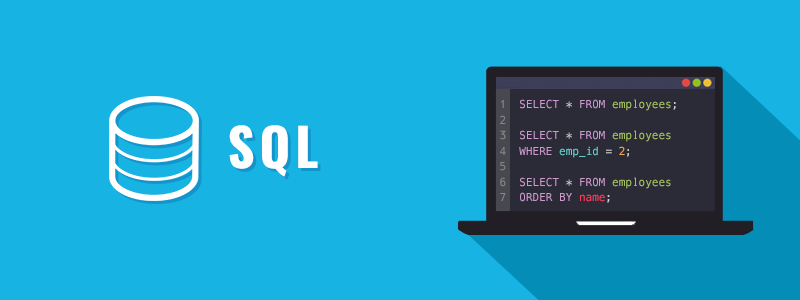

# My SQL Learning Hub & Project Repository



Welcome to my personal repository for learning and mastering MySQL. This space is dedicated to tracking my progress, storing useful scripts, and building projects that utilize relational database concepts.

---

## 📖 Table of Contents

- [**1. Core SQL Concepts**](#1-core-sql-concepts)
- [**2. Quick Command Reference**](#2-quick-command-reference)
  - [DDL (Data Definition Language)](#ddl-data-definition-language)
  - [DML (Data Manipulation Language)](#dml-data-manipulation-language)
  - [DQL (Data Query Language)](#dql-data-query-langauge)
- [**3. SQL Scripts & Projects**](#3-sql-scripts--projects)
- [**4. Advanced Topics & Snippets**](#4-advanced-topics--snippets)
  - [JOINs](#joins)
  - [Aggregate Functions & Grouping](#aggregate-functions--grouping)
  - [Transactions](#transactions)
- [**5. My Setup & Tools**](#5-my-setup--tools)
- [**6. Useful Resources**](#6-useful-resources)


## 1. Core SQL Concepts

A quick summary of the fundamental ideas behind relational databases.

- **Schema:** The logical container for a set of tables, views, and procedures. Essentially, the database itself.
- **Table:** A structured set of data consisting of rows and columns.
- **Row (or Record):** A single entry in a table, representing a single item of data.
- **Column (or Field):** A vertical entity in a table that contains all information of a specific type.
- **Primary Key (`PK`):** A column (or set of columns) that uniquely identifies each row in a table. It must be unique and cannot contain `NULL` values.
- **Foreign Key (`FK`):** A key used to link two tables together. It is a field in one table that refers to the `PRIMARY KEY` in another table.
- **Index:** A data structure that improves the speed of data retrieval operations on a database table at the cost of additional writes and storage space.
- **Normalization:** The process of organizing columns and tables in a relational database to minimize data redundancy.


## 2. Quick Command Reference

A cheatsheet of the most common SQL commands I use.

### DDL (Data Definition Language)
*Commands for defining and managing database structure.*

#### `CREATE`
Used to create databases and tables.
```sql
CREATE DATABASE my_new_database;
CREATE TABLE users (id INT PRIMARY KEY, name VARCHAR(100));
```

<!-- ### DML (Data Manipulation Language)   -->


<!-- ### DQL (Data Query Language) -->