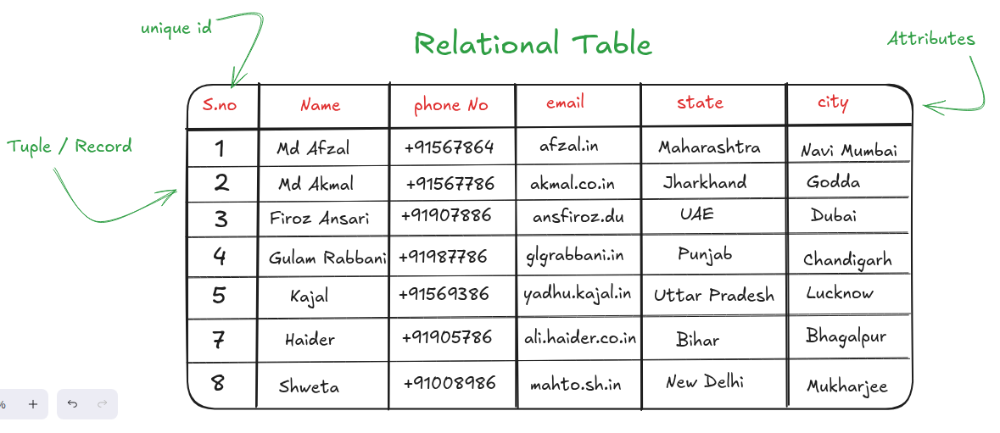

# Relational Database Management System (RDBMS)  
A **RDBMS**, or **Relational Database Management System**, is a type of software used to _create_, _manage_, and _interact_ with __relational databases__. 

**RDBMS** is based on the **relational model**.  

-   **Relational Model** is a concepts that uses a collection of tables to represent both data and the relationship among those data .  

-   A **relational database** is consist of a collection of **tables**, and each table has unique name .  

-   In **each table**, there is some row and column, **row** in a table represents a relationship among a set of values or entity or record and each **column** represents a particula attribute of that entity .

-   The relational model transforms conceptual diagram from ER diagram into implementable structure. These structures are used in **relational database systems** like : *mySQL*, *PostgreSQL*, *SQL Lite*, etc... 

**Example For Relational Model: (Basic Structure)**  

  

**In relational database, we must familiar with some basic concepts which will help us to understant, the relational database in more efficiently:**  

-   **What is an attribute:** _Attribute is an **unique name** in a relation that represent a specific type of data or value._

-   **What is `domain`:** _The set of possible values in each attributes or columns in the relation or table . It specifies the type of data that can be store in each attribute or column, e.g: **int**, **string**, **data**, **boolean**, etc._

-   **What is a constraints:** _It is a set of rules that ensure the integrity and validity of the data. Common constraints are: **NOT NULL**, **UNIQUE**, **CHECK**, & **DEFAULT**_

-   **Primary Key:** _It is a unique key that represent every tuple or record uniquely within a relation or table. This primary key should be **unique and not null**._

-   **Foreign Key:** _The foreign key is responsible to connect **two different tables** or this key is used to **establish relation** between two tables and it refers to another table's or relation's **primary key**._

### RDBMS _(Relational Database Management System)_ Schema  

_Before we begin with database schema, we should have a clear understanding between **database schema** & **database instanse**_  

-   **Database Schema:** _It is the logical design of the database_  
-   **Database Instanse:** _It is a snapshot of the data in the database at a given instant in a time._  

**Relation Schema:** It defines the design or structure of a relation or table in the database (RDBMS). OR **relation schema is consist of a list of attributes and their crossponding domains.**

-   The structure of the relation schema is fixed but the values of the relations or table keep changing . 
-   The **Relation Instance** is the value that changes in times, but the relation schema is fixed .

**Example Relation (A University Database):**  

-   _**`Department(Dept_name, Building_name, Budget)`**_
-   _**`Instructor(ID, Name, Dept_name, Salary)`**_
-   _**`Course(Course_ID, Title, Dept_name, Credits)`**_
-   _**`Section(Course_ID, Sec_ID, Semester, Year, Building, Room_No, Time_Slot_ID)`**_
-   _**`Teaches(ID, Course_ID, Sec_ID, Semester, Year)`**_
-   _**`Student(ID, Name, Dept_name, Tot_Cred)`**_
-   _**`Advisior(S-ID, I_ID)`**_
-   _**`Takes(ID, Course_ID, Sec_ID, Semester, Year, Grade)`**_
-   _**`Classroom(Building, Room_Number, Capacity)`**_
-   _**`Time_Slot(Time_Slot_ID, Dat, Start_Time, End_Time)`**_

-  _Here **Department** & **Instructor** are two different relations but **Dept_name** is an attribute which is common in both the relation, hence it establish, relationship between two relations._  

-   _Similarly we have the entire university's relation. So inside **University Database**, there are multiple relation which is mention above._ 

## University Database Sample Data

### `Department`

| Dept_name        | Building_name     | Budget        |
| :--------------- | :---------------- | :------------ |
| Computer Science | Turing Hall       | ₹1,50,00,000  |
| Physics          | Newton Block      | ₹95,50,000    |
| History          | Heritage Wing     | ₹45,00,000    |
| Biology          | Darwin Center     | ₹1,10,75,000  |

---

### `Instructor`

| ID    | Name              | Dept_name        | Salary      |
| :---- | :---------------- | :--------------- | :---------- |
| 10101 | Srinivasan        | Computer Science | ₹18,00,000  |
| 12121 | Dr. Verma         | Physics          | ₹15,50,000  |
| 15151 | Prof. Sharma      | History          | ₹13,00,000  |
| 22222 | Dr. Gupta         | Biology          | ₹16,75,000  |
| 76543 | Prof. Singh       | Computer Science | ₹21,00,000  |

---

### `Student`

| ID    | Name           | Dept_name        | Tot_Cred |
| :---- | :------------- | :--------------- | :------- |
| 98765 | Priya Sharma   | Computer Science | 92       |
| 87654 | Rohan Patel    | Computer Science | 58       |
| 76543 | Anjali Rao     | Biology          | 101      |
| 65432 | Vikram Singh   | Physics          | 45       |
| 54321 | Meera Desai    | History          | 76       |

---

### `Course`

| Course_ID | Title                | Dept_name        | Credits |
| :-------- | :------------------- | :--------------- | :------ |
| CS-101    | Intro to Programming | Computer Science | 4       |
| CS-347    | Database Systems     | Computer Science | 4       |
| PHY-101   | Classical Mechanics  | Physics          | 4       |
| HIS-205   | World History        | History          | 3       |
| BIO-101   | Intro to Biology     | Biology          | 3       |

---

### `Classroom`

| Building        | Room_Number | Capacity |
| :-------------- | :---------- | :------- |
| Turing Hall     | 101         | 60       |
| Turing Hall     | 212         | 45       |
| Newton Block    | 301         | 70       |
| Heritage Wing   | 110         | 50       |
| Darwin Center   | 100         | 120      |

---

### `Time_Slot`

| Time_Slot_ID | Day | Start_Time | End_Time |
| :----------- | :-- | :--------- | :------- |
| A            | MWF | 09:00      | 09:50    |
| B            | MWF | 11:00      | 11:50    |
| C            | TTh | 10:30      | 11:45    |
| D            | TTh | 14:00      | 15:15    |
| E            | F   | 13:00      | 15:50    |

---

### `Section`

| Course_ID | Sec_ID | Semester | Year | Building        | Room_No | Time_Slot_ID |
| :-------- | :----- | :------- | :--- | :-------------- | :------ | :----------- |
| CS-101    | 1      | Fall     | 2024 | Turing Hall     | 101     | A            |
| CS-347    | 1      | Fall     | 2024 | Turing Hall     | 212     | B            |
| PHY-101   | 1      | Fall     | 2024 | Newton Block    | 301     | C            |
| HIS-205   | 1      | Fall     | 2024 | Heritage Wing   | 110     | D            |
| BIO-101   | 1      | Fall     | 2024 | Darwin Center   | 100     | A            |

---

### `Advisor`

| S_ID  | I_ID  |
| :---- | :---- |
| 98765 | 76543 |
| 87654 | 10101 |
| 76543 | 22222 |
| 65432 | 12121 |
| 54321 | 15151 |

---

### `Teaches`

| ID    | Course_ID | Sec_ID | Semester | Year |
| :---- | :-------- | :----- | :------- | :--- |
| 10101 | CS-101    | 1      | Fall     | 2024 |
| 76543 | CS-347    | 1      | Fall     | 2024 |
| 12121 | PHY-101   | 1      | Fall     | 2024 |
| 15151 | HIS-205   | 1      | Fall     | 2024 |
| 22222 | BIO-101   | 1      | Fall     | 2024 |

---

### `Takes`

| ID    | Course_ID | Sec_ID | Semester | Year | Grade |
| :---- | :-------- | :----- | :------- | :--- | :---- |
| 98765 | CS-347    | 1      | Fall     | 2024 | A     |
| 87654 | CS-101    | 1      | Fall     | 2024 | B+    |
| 87654 | CS-347    | 1      | Fall     | 2024 | A-    |
| 76543 | BIO-101   | 1      | Fall     | 2024 | A     |
| 65432 | PHY-101   | 1      | Fall     | 2024 | B     |
| 54321 | HIS-205   | 1      | Fall     | 2024 | A-    |

## Keys  

A relation always has a field which uniquely identify each row in a relation or table . A **value** or **set of values** which is *uniquely identify* throughout all of the rows of the table . Each row is distinct and can be identified by the values of one or more of it's attributes called **key** .  

A key allow us to identify a set of attributes or fields that suffices to distinguish entities from each other .  

**The keys can categorized into :**  
1. [Super Key](#super-key)
2. [Candidate Key](#candidate-key)
3. [Primary Key](#primary-key)
4. [Alternet Key](#alternet-key)
5. [Composite Key](#composite-key)
6. [Foregin Key](#foregin-key)

### Super Key  
A Super is an attribute or set of attributes that help us to identify each row uniquely in the relation or table .  

**Example:** We have a cutomer table where we have following attributes :  

-   **customer_id**
-   **customer_name**
-   **customer_email_id**
-   **customer_address**
-   **customer_phoneNo**  
... *and so on*  

Now, in the above attributes, the **_customer_id_** is one of the **super key** because it can easily identify each row or tuple in a table or relation uniquely.  

Similar to *customer_id*, the combination or **_customer_id_** & **_customer_name_** can form **super key** that can identify each row uniquely .  

With the same example if you try to consider **_customer_name_** as a **super key**, they it would be wrong because it is highly possibly that two customer's have same name . So the attribute **customer_name** alone cannot be a _super key_ .  

### Candidate Key  
Minimal Super Keys are called **Candidate Keys** . Means every candidate key is a super key, but not all super key can be a candidat key.  

Using a candidate key, we can uniquely determine the values of all other attributes in a table.   

It is possible that several distinct sets of attributes could serve as a candidate key. Suppose that a combination of **name** and **dept name** is sufficient to distinguish among members of the **instructor relation**. Then, both **{ID}** and **{name, dept name}** are **candidate keys**. Although the attributes ID and name together can distinguish *instructor tuples*, their combination, **{ID,
name}**, does not form a *candidate key*, since the attribute **ID** alone is a **candidate key**. 

**Features of Candidate Key :**  
-   A candidate has unique values for every rows in a table .
-   Every candidate key is a super key, but not all super keys qualify as candidate keys . 
-   A candidate key can contain null values, but this depands on the database's design and constraints .  

- The [primary key](#primary-key) is chosen from the set of candidate keys.

### Primary Key  

When one or more number of attributes uniquely identify the row is called primary key . It cannot contain any **null values** or it is **unique** .  

The **primary key** should be chosen such that it's attribute values are never, or very rarely changed .  

**Example:**  

The address of a customer cannot be a primary number because the address can be change over time but the **social-security number**, like **aadhar-card**, **pan-card** are never change so they can be a primary key .

### Alternet Key
The alternet key of any table are those candidate keys which are not currently selected as primary key .  

**Example:**  The combination of **roll_no** and **name** as *candidate key* . *roll_no* alone is a **primary key** and the *name* alone is an *alternet key* .  

### Composite Key  

A primary key that is made up of more than one attributes known as a composite key .  

**Example:** _Project(P_id, E_id, E_name, Hours_Work)_  

### Foregin Key  

The attribute of one table is **_referance_** a *primary key* of the another table is called a **foregin key** .  

Foregin key provide a method for **maintaining integrity** and for **navigation between different instances** of tables .  

Foregin key's values must be matched by the corresponding primary key values .  

**Let Say:**  A relation r1, may include among it's attributes, the primary key of an other-relation say r2 . This attribute called a **foregin key** from r1, referencing r2 .  

-   The relation r1, is also called the referencing relation of the foregin key dependency .
-   The relation r2, is called the referenced relation of the foregin key . 

**Example:**  
the attribute _**dept_name**_ in relation instructor is a foregin key ***depart-ment***, since ***dept_name*** is the primary key of ***department*** .  

The domain value of the **primary_key** and the **foregin_key** must be same .  

## Database Schema  

**Datbase Schema** is the logical design of the database, and the **database instanse**, which is a snapshot of the data in the database at a given instant in time .  

**Relation Schema** is the design of a relation, or table . It consist of a list of attributes and their corresponding domains .  

The schema of a relation generally does not change, but the instanse of a relation update over time .  

**Example :**  Let say the _department_ relation, The schema of the department relation is : **_department(dept_name, building, budget)_** and let say the _instructor_ relation, the schema for instructor relation will be : ___instructor(id, name, dept_name, salary)___  

If we see, the **dept_name** is same in both the ***instructor schema*** and the ***department schema*** .  

Using this type of common attributes in two different relations schemas is one way of relating tuples of distinct relations .  

## Relational Query Language  

A query language is a language in which a user requests information form the database .  

There are two types of **query languages** :  
-   Procedural 
-   Non-Procedural

**Procedural Language**  
In procedural query language the user instruct the system to perform sequence of operations on the database to compute the desired result .  

**Non-Procedural Language**  
In Non-Procedural Query Language, the user describe the desired information without giving a specific procedure for obtaining that information .  

Most RDBMS offer a query language that include the element of both, **the procedural or non-procedural approaches** .  

***Query Languages :***   
-   **The Relation Algebra** is a *procedural language*,
-   **The Tuple Relation Calculus** and **The Domain Relation Calculus** are *non-procedural language* .  