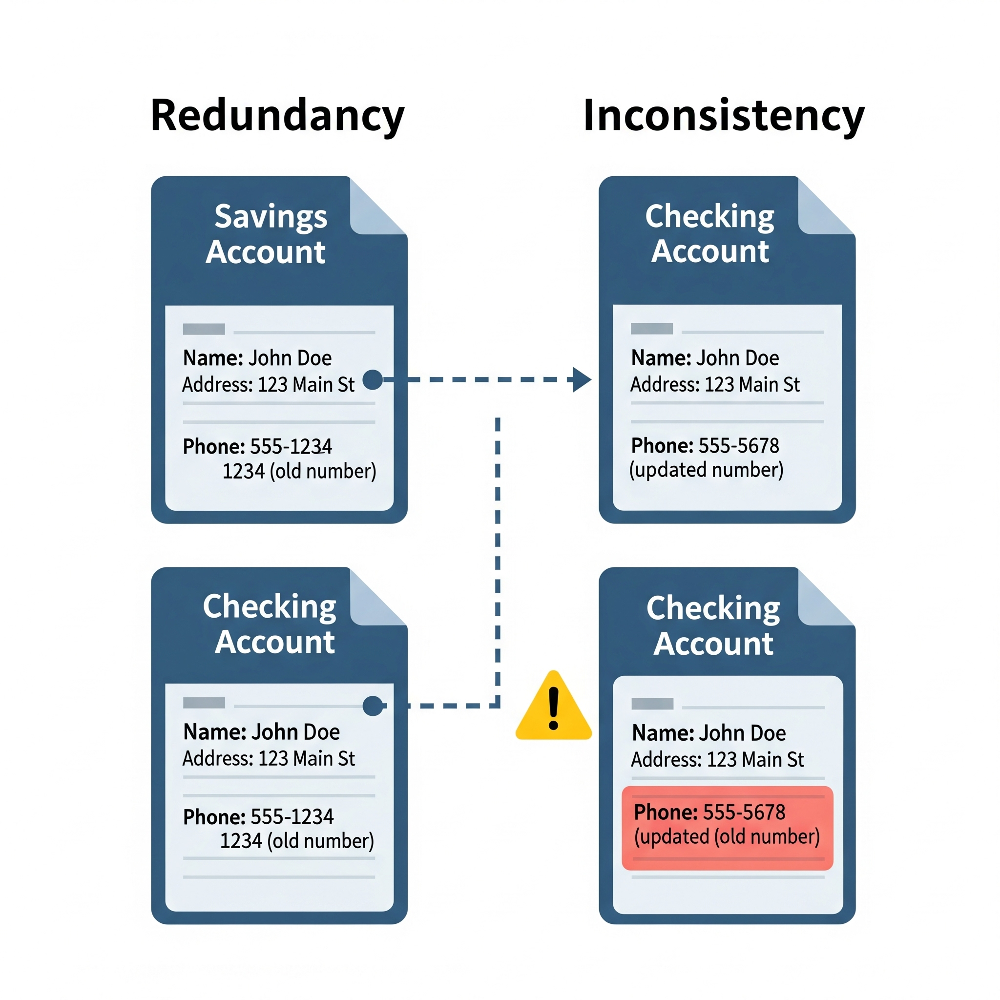
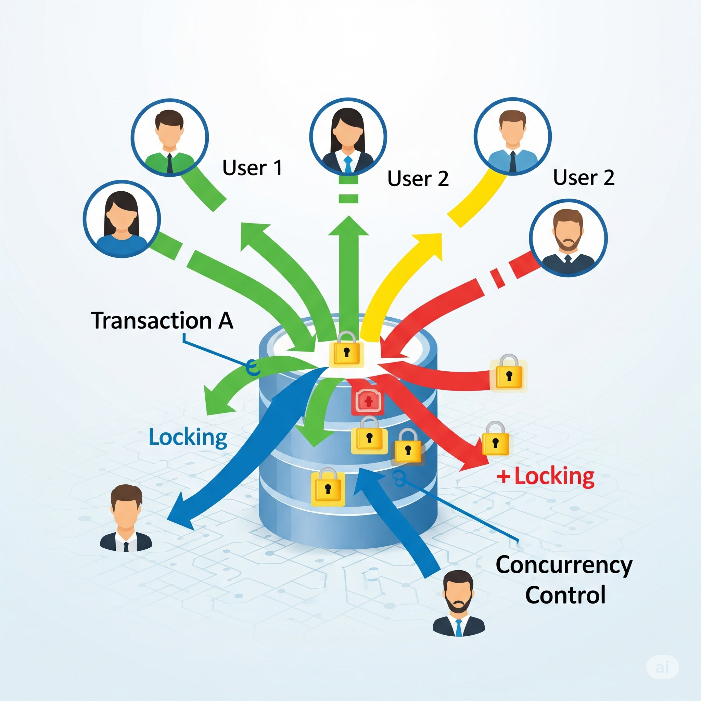
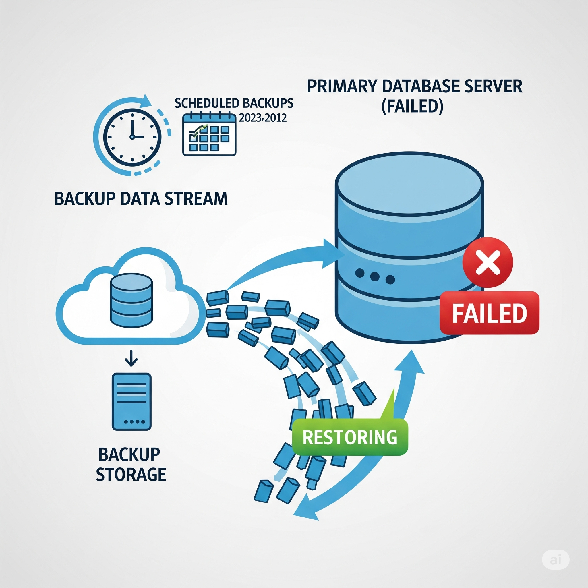
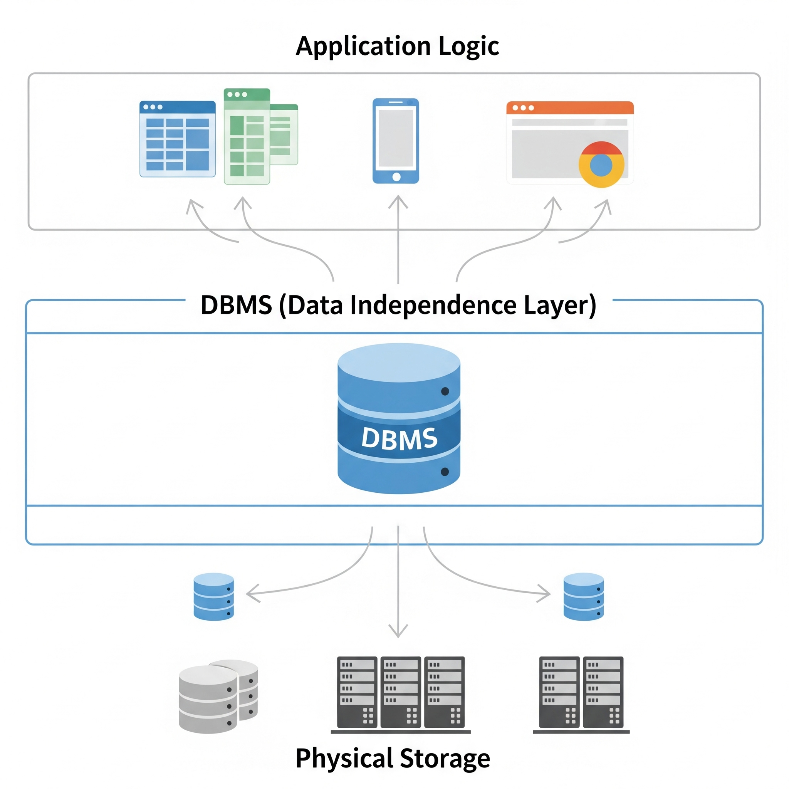

# Database Management Systems (DBMS)

This repository provides a foundational overview of _Database Management Systems_ (DBMS), their **types**, **core concepts**, and their **role** in _modern software development_.  

## 📖 Table of Contents
1. [What is a DBMS?](#1-what-is-a-dbms)
    -  [Applications Of DBMS](#applications-of-dbms)
2. [Why Use a DBMS? (Key Advantages)](#2-why-use-a-dbms-key-advantages)
3. [Core Components of a DBMS Environment](#3-core-components-of-a-dbms-environment)
4. [Types of DBMS](#4-types-of-dbms)
    - [Relational DBMS (RDBMS)](#relational-dbms-rdbms)
    - [NoSQL DBMS](#nosql-dbms)
    - [Other Historical Models (Hierarchical & Network)](#other-historical-models)
5. [Key Concepts in DBMS](#5-key-concepts-in-dbms)
    - [ACID Properties](#acid-properties)
    - [Data Abstraction](#data-abstraction)
    - [Schema vs. Instance](#schema-vs-instance)
6. [RDBMS vs. NoSQL: A Quick Comparison](#6-rdbms-vs-nosql-a-quick-comparison)
7. [Conclusion](#7-conclusion)

## 1. What is a DBMS?

A **Database Management System (DBMS)** is a software application that allows users to **create**, **manage**, **retrieve**, and **update** data in a ___structured___ and ___organized___ way. Think of it as a sophisticated digital librarian for your data. And collection of data, usually refers for as the **database**, contains information related to an **enterprices**.

Instead of storing data in simple flat files (like spreadsheets or text files), a DBMS provides a systematic method to handle large amounts of data efficiently, ensuring its **safety**, **security**, and **integrity**.

The primary goal of a DBMS is to provide an environment that is both **convenient** and **efficient** to use.  

### Applications Of DBMS  
**_Database are widely used_**  
1. **Banking** _Used to store customer information, accounts, loans & banking transactions_  
2. **Airlines & Railways** _Used for **reservation** and **schedule** information._  
3. **Universities** _Used to store, **students** & **teachers** information, students credits or grades, schools, and also managing the library_
4. **Sales** _Used to store customer information and their purchase history, payments, products_  
5. **Telecommunication** _Used to keep records of calls made and generating monthely bills_
6. **Manufacturing** _Used for management of the supply chain and tracking production of items, inventories of items in warehouses and stores and orders items_ 

**and so on, there are many application now a days used dbms in the entire world**

## 2. Why Use a DBMS? (Key Advantages)

Using a DBMS offers significant advantages over traditional file-based systems:

-   **Controls Data Redundancy & Inconsistency:**  
    
    
    -   Since different programmers create the _files_ and _application programs_ over a long period, and verious files are likely to have different **file structures** and the program may be written in different **programming languages**.
    -   It is highley possible that the same information may be duplicated in more than one files or saveral places.  
    **Example :**  

        -   The _address_ and the _phone number_ of a perticular **customer** may be apper in a file that consist of **_saving-account_** record and in a file that consist of **_checking-account_** record . Becuase of the same information store in two different files, so this **_redundency_** leads to **higher storage** and **access cost**.  
    -   Also it may lead to data **inconsisteny** that is the various copies of the same data, may no longer agree.  
    **Example :**  

        -   Customer change the **_phone number_** and this change is appeared only in **_saving-account_** records but not elsewhere in the **file** or **system**.

-   **Enforces Data Integrity:**  
    
    
    It means that it ensures that the data is accurate and consistent through consistency constraints (Rules).   
    **Example :**  
    
    -   _Ensuring a user's age is a positive number_. **(age < 0)**.
    -   The **_balance_** of a bank account may never fall below a fixed amount. say, **$25**.
    -   **_Studnt of arts_**, cannot take books for **_computer science_** library.

-   **Improves Data Security:**  
    
    

    -   Provides robust mechanisms for authentication and authorization, restricting access to sensitive data.  
    -   Not every user of the database system should be able to access all the data.  
    **Example : In a Banking System, (Payroll)**  
        
        -   _The **payroll team** is allowd to see only that part of the **database** that has information about various **bank employees**_.  

-   **Supports Concurrent Access:**  
    
    
    -   _Concurrent Access_ means that when multiple users access the same data from **database**, from **_different locations_**, or **_same time_** or at the **_same moments_**.  

-   **Provides Backup and Recovery:**  
    
    
    Offers tools to back up data **periodically** and recover it in case of **system failure**.  
    In many applications, it;s crucila that, if a failure occures, the data must be *restore* to it's *previous state* .

-   **Enables Data Independence:**  
    
    
    Separates the **application logic** from the **physical data storage**, meaning you can change the __storage structure__ without having to modify the _application code_.

## 3. Core Components of a DBMS Environment

A complete DBMS environment consists of five main components:

1.  **Hardware:** The physical devices like computers, storage devices, and I/O channels.
2.  **Software:** The DBMS application itself (e.g., MySQL, MongoDB, Oracle).
3.  **Data:** The most important component—the actual collection of information being stored.
4.  **Procedures:** The set of rules and instructions on how to use the DBMS.
5.  **Users:** The individuals who interact with the database. This includes:
    -   **Database Administrators (DBAs):** Manage the overall DBMS.
    -   **Application Programmers:** Write applications that interact with the database.
    -   **End-Users:** Access the data for querying and reporting.

## 4. Types of DBMS

Databases can be classified based on their underlying data model. The two most prominent types in modern development are **Relational** and **NoSQL**.

### Relational DBMS (RDBMS)
This has been the dominant model for decades. Data is stored in a structured format using tables with rows and columns.

-   **Data Structure:** Tables (relations).
-   **Key Characteristic:** Enforces strict schema, data integrity, and relationships using primary and foreign keys.
-   **Query Language:** Primarily uses **SQL (Structured Query Language)**.
-   **Examples:** **[MySQL](./MYSQL.md)**, **PostgreSQL**, Microsoft SQL Server, Oracle Database.

**For More Information About Relational Database, Follow The Following Link:**  
_**[RDBMS](./README-RDBMS.md)**_

### NoSQL DBMS
"NoSQL" stands for "Not Only SQL". This category emerged to handle the large volumes, high velocity, and unstructured data of modern web applications (Big Data). They are generally more flexible and scalable than RDBMS.

NoSQL databases are further divided into several types:

#### 1. Document Stores
-   **Data Structure:** Data is stored in flexible, JSON-like documents. Each document can have its own unique structure.
-   **Use Case:** Content management, e-commerce platforms, mobile app backends.
-   **Examples:** **MongoDB**, Couchbase.

#### 2. Key-Value Stores
-   **Data Structure:** The simplest model, where data is stored as a key-value pair.
-   **Use Case:** Caching, session management, real-time leaderboards.
-   **Examples:** **Redis**, Amazon DynamoDB.

#### 3. Column-Family Stores
-   **Data Structure:** Data is stored in columns rather than rows. This is efficient for queries over large datasets where you only need to read a subset of columns.
-   **Use Case:** Big data analytics, logging, time-series data.
-   **Examples:** **Apache Cassandra**, HBase.

#### 4. Graph Stores
-   **Data Structure:** Data is stored as nodes (entities) and edges (relationships).
-   **Use Case:** Social networks, recommendation engines, fraud detection.
-   **Examples:** **Neo4j**, Amazon Neptune.

### Other Historical Models
-   **Hierarchical Model:** Organizes data in a tree-like structure. Data is stored as records connected through links.
-   **Network Model:** A more flexible extension of the hierarchical model, allowing many-to-many relationships in a graph-like structure.

## 5. Key Concepts in DBMS

### ACID Properties
A set of properties that guarantee data reliability during transactions, especially in RDBMS.

-   **Atomicity:** A transaction is an "all or nothing" operation. If any part fails, the entire transaction is rolled back.
-   **Consistency:** A transaction brings the database from one valid state to another, preserving database integrity.
-   **Isolation:** Concurrent transactions are executed in a way that they do not interfere with each other.
-   **Durability:** Once a transaction is committed, its changes are permanent, even in the event of a system failure.

### Data Abstraction
A DBMS hides the complexity of data storage from users. This is achieved through three levels:

1.  **Physical Level:** The lowest level, describing *how* data is physically stored.
2.  **Logical Level:** The next level, describing *what* data is stored and what relationships exist.
3.  **View Level:** The highest level, describing only a part of the entire database, tailored for a specific user group.

### Schema vs. Instance
-   **Schema:** The overall design or "blueprint" of the database (e.g., the `CREATE TABLE` statements). It does not change frequently.
-   **Instance:** A "snapshot" of the data in the database at a specific moment in time. It changes whenever data is added, updated, or deleted.

## 6. RDBMS vs. NoSQL: A Quick Comparison

| Feature | RDBMS (e.g., MySQL) | NoSQL (e.g., MongoDB) |
| :--- | :--- | :--- |
| **Data Model** | Structured (Tables with rows and columns) | Flexible (Documents, Key-Value, etc.) |
| **Schema** | Pre-defined and strict | Dynamic and flexible |
| **Scalability** | Vertical (increase power of a single server) | Horizontal (distribute load across many servers) |
| **ACID Compliance** | Typically fully ACID compliant | Varies; often prioritizes availability and speed (BASE model) |
| **Query Language** | SQL (Structured Query Language) | Varies (e.g., MQL for MongoDB, CQL for Cassandra) |
| **Best For** | Applications requiring high data integrity, complex queries, and transactions (e.g., banking, e-commerce checkout). | Big data applications, real-time systems, and apps with evolving requirements. |

